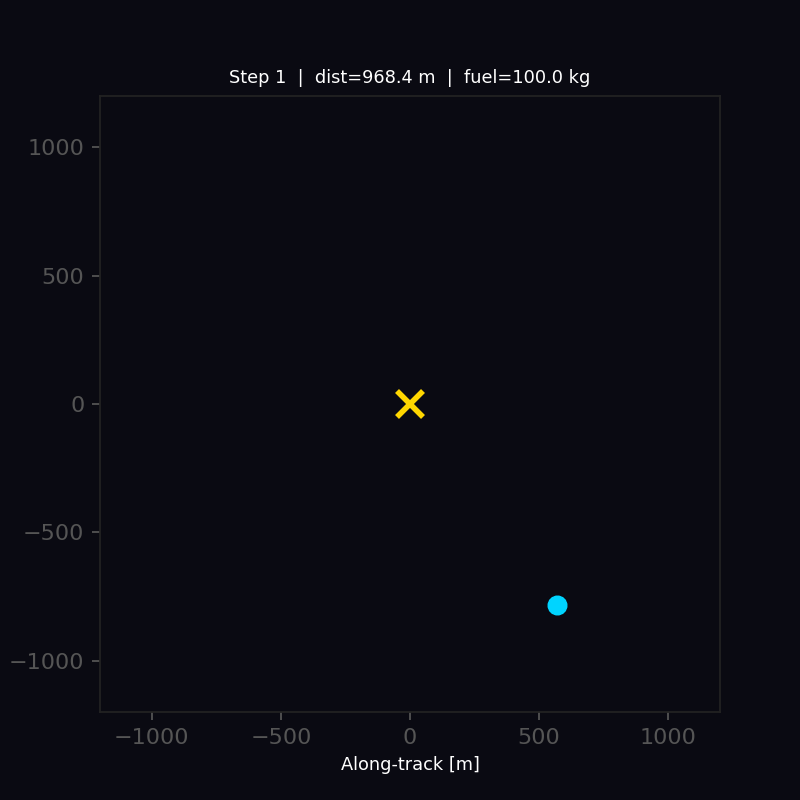
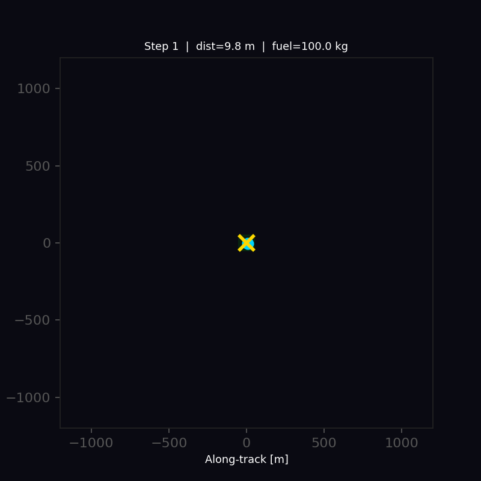
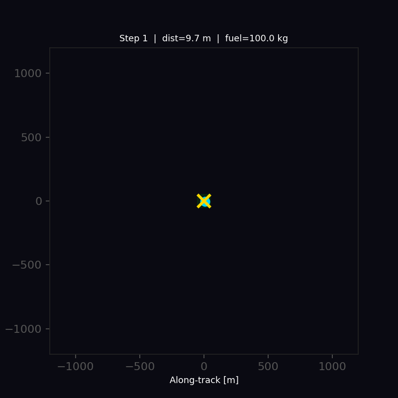
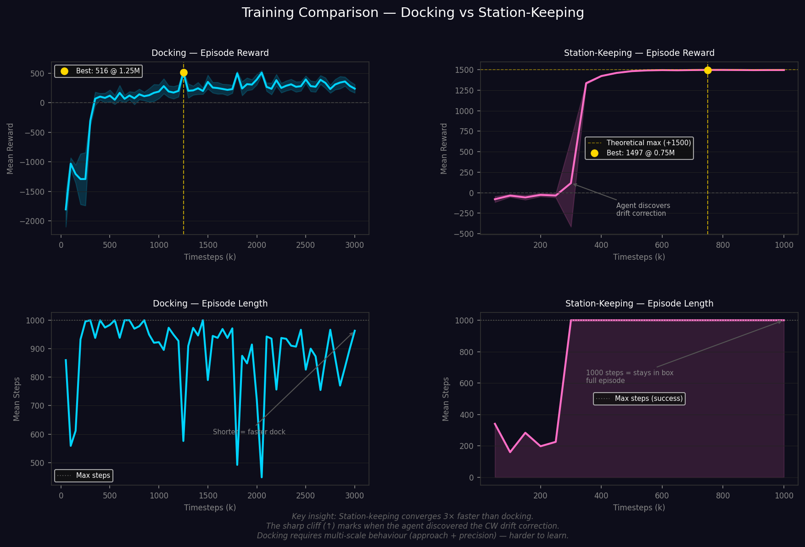
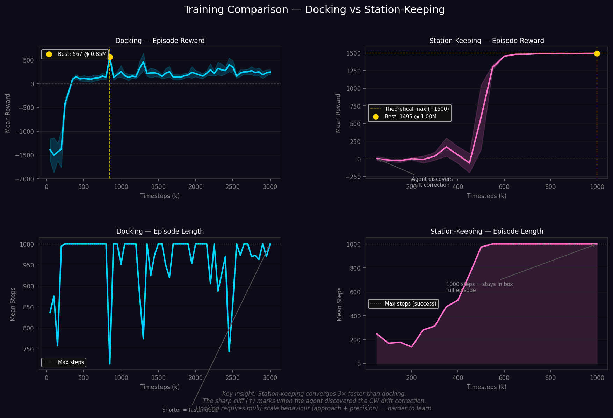

# 🛰️ Orbital RL

> **Reinforcement Learning for autonomous spacecraft docking and orbital station-keeping — built from first-principles CW equations in a custom Gymnasium environment.**


---

| 2D Docking | 2D Station-Keeping |
|:---:|:---:|
|  |  |
| **100% success rate** | **100% success rate** |

| 3D Docking | 3D Station-Keeping |
|:---:|:---:|
|  |  |
| **99% success rate** | **100% success rate** |

---

## What is this?

A PPO agent trained to solve two spacecraft control problems from scratch using real orbital mechanics, in both 2D (in-plane) and full 3D:

| Task | Goal | 2D Result | 3D Result |
|---|---|---|---|
| **Docking** | Navigate from ±1 km and dock within 1 m at < 0.5 m/s | **100% success** | **99% success** |
| **Station Keeping** | Hold position inside a 50 m orbital box for 1000 steps | **100% success, 0.10 m from centre** | **100% success, 0.27 m from centre** |

Both tasks are simulated in **Hill's Frame (LVLH)** using the **Clohessy-Wiltshire (CW) equations** — the standard linearisation for relative orbital motion used in real mission design. The agent observes position, velocity, and fuel; it outputs continuous thrust commands on two or three axes.

---

## The Physics

### Clohessy-Wiltshire Equations

For a chaser in near-circular orbit relative to a target, the full 3D relative equations of motion are:

**In-plane (coupled via Coriolis):**
$$\ddot{x} = 3n^2 x + 2n\dot{y} + f_x$$
$$\ddot{y} = -2n\dot{x} + f_y$$

**Out-of-plane (decoupled harmonic oscillator):**
$$\ddot{z} = -n^2 z + f_z$$

Where:
- $(x, y, z)$ — radial, along-track, and cross-track position relative to the target
- $n = \sqrt{\mu / a^3}$ — mean motion of the reference orbit
- $\mu = 3.986 \times 10^{14}\ \text{m}^3/\text{s}^2$ — Earth's gravitational parameter
- $f_x, f_y, f_z$ — specific thrust force per axis

The z-axis is **fully decoupled** from the x-y dynamics — a key property that makes 3D control tractable. Integrated via **sub-stepped Runge-Kutta 4** (10 substeps per environment step).

### Reference Orbit

| Parameter | Value |
|---|---|
| Altitude | 400 km (ISS-like LEO) |
| Semi-major axis | ~6 771 km |
| Mean motion $n$ | ~0.001131 rad/s |
| Orbital period | ~92.5 minutes |

---

## Project Structure

```
orbital-rl/
├── envs/
│   ├── dynamics.py              # Full 3D CW equations + RK4 propagator
│   └── orbital_env.py           # Gymnasium environment (both tasks, 2D/3D)
├── scripts/
│   ├── validate_physics.py      # Physics sanity checks — run before training
│   └── plot_comparison.py       # Side-by-side training comparison plot
├── tests/
│   └── test_dynamics.py         # 31 unit tests (physics + environment + 3D)
├── notebooks/
│   └── demo.ipynb               # Interactive walkthrough
├── models/
│   ├── docking_2d/best/         # Trained 2D docking agent   (100% success)
│   ├── docking_3d/best/         # Trained 3D docking agent   ( 99% success)
│   ├── station_keeping_2d/best/ # Trained 2D station-keeping (100% success)
│   └── station_keeping_3d/best/ # Trained 3D station-keeping (100% success)
├── assets/                      # GIFs, learning curves, comparison plots
├── train.py                     # Training entry point
├── enjoy.py                     # Watch a trained agent fly + save GIFs
├── evaluate.py                  # Benchmark agents, generate learning curves
└── play.py                      # Human-playable keyboard docking
```

---

## Quickstart

```bash
git clone https://github.com/FK-75/orbital-rl.git
cd orbital-rl
pip install -r requirements.txt

# Validate the physics before anything else
python scripts/validate_physics.py

# Run the test suite
pytest tests/ -v

# Watch the trained agents
python enjoy.py --task docking --mode 2d
python enjoy.py --task docking --mode 3d
python enjoy.py --task station_keeping --mode 2d
python enjoy.py --task station_keeping --mode 3d

# Try docking yourself — arrow keys to thrust, R to reset, Q to quit
python play.py --mode 2d
python play.py --mode 3d
```

---

## Training

```bash
# 2D training
python train.py --task docking         --mode 2d --timesteps 3000000 --n_envs 8 --device cpu
python train.py --task station_keeping --mode 2d --timesteps 1000000 --n_envs 8 --device cpu

# 3D training
python train.py --task docking         --mode 3d --timesteps 3000000 --n_envs 8 --device cpu
python train.py --task station_keeping --mode 3d --timesteps 1000000 --n_envs 8 --device cpu

# Resume from a checkpoint
python train.py --task docking --mode 2d --resume models/docking_2d/best/best_model.zip --timesteps 2000000

# Monitor live
tensorboard --logdir logs/
```

### PPO Hyperparameters

| Hyperparameter | Value | Rationale |
|---|---|---|
| Learning rate | 3e-4 | Standard Adam default |
| Steps per rollout | 2048 | Long enough to capture full approach |
| Batch size | 256 | Stable gradient estimates |
| Epochs per update | 10 | Sufficient reuse without divergence |
| Discount γ | 0.99 | Long-horizon task |
| Entropy coefficient | 0.005 | Mild exploration pressure |
| Policy network | MLP [256, 256] | Sufficient for low-dim obs |

---

## Observation & Action Spaces

**Observation space:**

| Index | Variable | Scale | 2D Docking | 3D Docking | 2D SK | 3D SK |
|---|---|---|:---:|:---:|:---:|:---:|
| 0 | Radial position $x$ | ÷ 1000 m | ✓ | ✓ | ✓ | ✓ |
| 1 | Along-track position $y$ | ÷ 1000 m | ✓ | ✓ | ✓ | ✓ |
| 2 | Cross-track position $z$ | ÷ 1000 m | — | ✓ | — | ✓ |
| 3 | Radial velocity $\dot{x}$ | ÷ 10 m/s | ✓ | ✓ | ✓ | ✓ |
| 4 | Along-track velocity $\dot{y}$ | ÷ 10 m/s | ✓ | ✓ | ✓ | ✓ |
| 5 | Cross-track velocity $\dot{z}$ | ÷ 10 m/s | — | ✓ | — | ✓ |
| — | Remaining fuel | ÷ 100 kg | ✓ | ✓ | ✓ | ✓ |
| — | CW drift correction $-2nx$ | ÷ 10 m/s | — | — | ✓ | ✓ |

The drift correction feature encodes the along-track velocity required to cancel the secular CW drift from the current radial offset — making station-keeping tractable without requiring the agent to rediscover Keplerian mechanics from scratch.

**Action space** (continuous):

| Mode | Axes | Dimensions |
|---|---|---|
| 2D | $[f_x, f_y]$ | 2, each in [−0.1, +0.1] m/s² |
| 3D | $[f_x, f_y, f_z]$ | 3, each in [−0.1, +0.1] m/s² |

---

## Reward Design

### Docking

| Signal | Value | Purpose |
|---|---|---|
| Distance penalty | $-d / 1000$ per step | Constant pull toward target at all ranges |
| Proximity bonus | $+0.5 / (d + 0.5)$ per step | Gradient steepens near target — doubles each time $d$ halves |
| Speed bonus | $+0.3 \cdot \max(0, 1 - v/v_{dock})$ when $d < 50$ m | Rewards gentle final approach |
| Terminal dock bonus | $+500$ on success | Makes docking worth more than any amount of hovering |
| Fuel penalty | $-0.005 \|\mathbf{f}\| / f_{max}$ | Discourages wasteful burns |

The $1/(d + \varepsilon)$ shaping has no inflection point — unlike exponential shaping, the gradient never becomes negligible, so no hovering equilibrium exists at any distance.

### Station Keeping

| Signal | Value | Purpose |
|---|---|---|
| In-box reward | $+1.0 + 0.5(1 - r/r_{box})$ per step | Rewards being inside; bonus for staying near centre |
| Out-of-box penalty | $-1.0 - d_{edge}/(2 \cdot r_{box})$ per step | Shaped gradient pulls agent back toward box |
| Fuel penalty | $-0.005 \|\mathbf{f}\| / f_{max}$ | Discourages wasteful burns |

---

## Results

### Training Comparison (2D)



### Training Comparison (3D)



The plots show contrasting learning dynamics: docking requires a slow noisy climb over millions of steps, while station-keeping converges via a sharp cliff when the agent discovers the drift correction strategy.

### Final Evaluation — All Four Models

| Task | Mode | Success | Mean Reward | Mean Final Dist | Mean Speed | Fuel Left |
|---|---|---|---|---|---|---|
| Docking | 2D | **100%** | +517.4 ± 40.7 | 0.99 m | 0.011 m/s | 99.4 kg |
| Docking | 3D | **99%** | +576.0 ± 72.9 | 1.00 m | 0.007 m/s | 99.4 kg |
| Station-keeping | 2D | **100%** | +1497.3 ± 0.7 | 0.10 m | 0.000 m/s | 99.9 kg |
| Station-keeping | 3D | **100%** | +1495.1 ± 0.9 | 0.27 m | 0.000 m/s | 99.9 kg |

Station-keeping theoretical maximum is +1500. Both agents score >99.7% of this. The 3D docking agent arrives with a *lower* mean speed than 2D (0.007 vs 0.011 m/s) — the additional z-axis provided early easy wins that improved the value function, leading to a more cautious final approach.

### Learning Curve Highlights

| Task | Mode | Best checkpoint | Convergence |
|---|---|---|---|
| Docking | 2D | +516 @ 1.25M steps | ~3M steps for stable success |
| Docking | 3D | +567 @ 0.85M steps | ~3M steps for stable success |
| Station-keeping | 2D | +1497 @ 0.75M steps | ~350k steps — sharp cliff |
| Station-keeping | 3D | +1495 @ 1.00M steps | ~550k steps — sharp cliff |

---

## Reward Engineering Notes

Getting all four agents to train required several non-obvious design decisions documented here for reproducibility:

**Docking — the hovering problem.** An exponential shaping term `exp(-d/20)` plateaus near the target, giving the agent almost no gradient for the last few metres. The agent learned to hover at ~3 m indefinitely — reward was nearly identical at 3 m and 1 m. Replacing it with `1/(d + 0.5)` ensures the gradient always increases as the agent gets closer. A +500 terminal bonus makes docking worth more than hovering for any number of steps.

**Station-keeping — the initialisation problem.** With a 50 m box and random starts up to ±1 km, only 0.26% of episodes started inside the box. The agent never encountered positive reward and produced 100% runaways across 1M steps. Restricting resets to within 0.3× the box width (±15 m) gave immediate positive signal from step 1.

**Station-keeping — the drift hint.** The CW secular drift (`y(t) = -6nx₀t`) requires a specific velocity correction (`vy = -2nx`) to cancel. Without this, the agent failed across 1M steps. Adding `−2nx` as an explicit observation feature produced convergence at ~350k steps (2D) and ~550k steps (3D).

---

## Scripts Reference

| Script | Description |
|---|---|
| `train.py` | Train PPO — `--task`, `--mode 2d/3d`, `--timesteps`, `--resume`, `--fresh` |
| `enjoy.py` | Watch trained agent, save GIFs — `--task`, `--mode`, `--save_gif` |
| `evaluate.py` | Benchmark model, generate learning curves — `--task`, `--mode`, `--curve` |
| `play.py` | Human-playable keyboard control — `--task`, `--mode` |
| `scripts/validate_physics.py` | CW propagator sanity checks with plots |
| `scripts/plot_comparison.py` | Side-by-side training comparison plot |

---

## References

1. Clohessy, W.H. & Wiltshire, R.S. (1960). *Terminal Guidance System for Satellite Rendezvous.* Journal of the Aerospace Sciences, 27(9), 653–658.
2. Schulman, J. et al. (2017). *Proximal Policy Optimization Algorithms.* arXiv:1707.06347.
3. Raffin, A. et al. (2021). *Stable-Baselines3: Reliable Reinforcement Learning Implementations.* JMLR 22(268).

---

## License

MIT