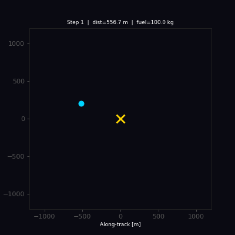
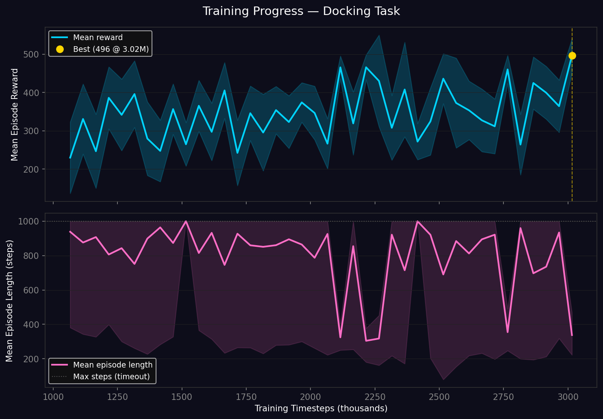
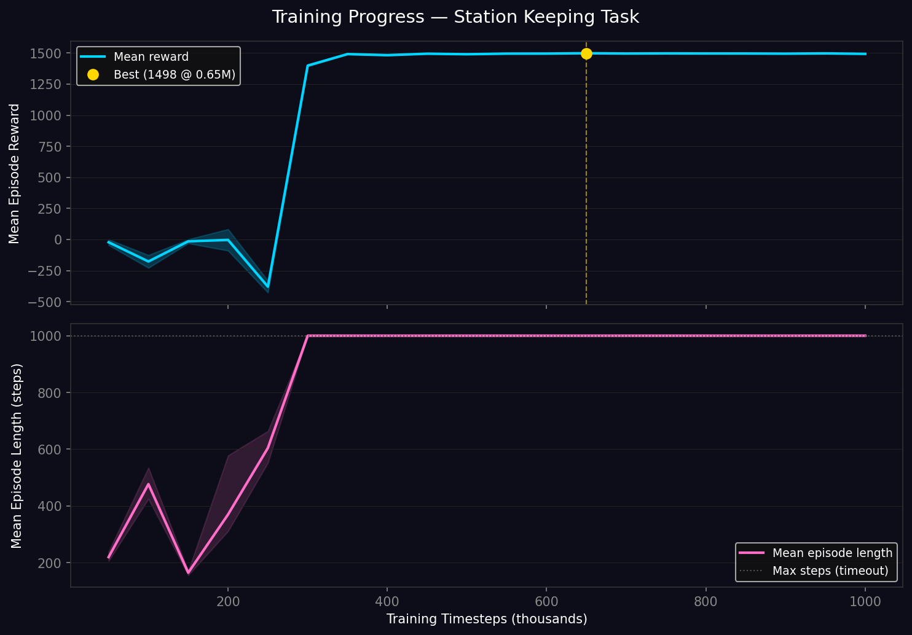

# 🛰️ Orbital RL

> **Reinforcement Learning for autonomous spacecraft docking and orbital station-keeping — built from first-principles CW equations in a custom Gymnasium environment.**


---



## What is this?

This project trains a neural network agent to solve two spacecraft control problems using real orbital mechanics:

| Task | Goal |
|---|---|
| **Docking** | Navigate a chaser from a random position (±1 km) to dock within 1 m at < 0.5 m/s |
| **Station Keeping** | Hold position inside a 50 m orbital box while minimising ΔV |

Both tasks are simulated in **Hill's Frame (LVLH)** using the **Clohessy-Wiltshire (CW) equations** — the standard linearisation for relative orbital motion used in real mission design. The agent is trained with **PPO** (Proximal Policy Optimization) via Stable Baselines 3.

---

## The Physics

### Clohessy-Wiltshire Equations

For a chaser in near-circular orbit relative to a target, the relative equations of motion are:

$$\ddot{x} = 3n^2 x + 2n\dot{y} + f_x$$
$$\ddot{y} = -2n\dot{x} + f_y$$

Where:
- $(x, y)$ — radial and along-track position relative to the target
- $n = \sqrt{\mu / a^3}$ — mean motion of the reference orbit
- $\mu = 3.986 \times 10^{14}\ \text{m}^3/\text{s}^2$ — Earth's gravitational parameter
- $f_x, f_y$ — specific thrust force (acceleration) per axis

Note: free drift from a radial offset produces a secular along-track drift — this is physically correct CW behaviour, not an integration error.

Integrated numerically via **sub-stepped Runge-Kutta 4** (10 substeps per environment step).

### Reference Orbit

| Parameter | Value |
|---|---|
| Altitude | 400 km (ISS-like LEO) |
| Semi-major axis | ~6 771 km |
| Mean motion $n$ | ~0.001131 rad/s |
| Orbital period | ~92.5 minutes |

---

## Project Structure

```
orbital-rl/
├── envs/
│   ├── __init__.py
│   ├── dynamics.py          # CW equations + RK4 propagator
│   └── orbital_env.py       # Gymnasium environment (docking & station-keeping)
├── scripts/
│   └── validate_physics.py  # Physics sanity checks — run before training
├── tests/
│   └── test_dynamics.py     # Unit tests for propagator and environment
├── notebooks/
│   └── demo.ipynb           # Interactive walkthrough
├── models/
│   └── docking/
│       └── best/
│           └── .gitkeep     # Placeholder only; trained weights are gitignored
├── assets/
│   ├── docking_demo.gif
│   ├── learning_curve_docking.png
│   └── learning_curve_station_keeping.png
├── train.py
├── enjoy.py
├── evaluate.py
├── requirements.txt
├── .gitignore
├── LICENSE
└── README.md
```

---

## Quickstart

```bash
# 1. Clone and install
git clone https://github.com/YOUR_USERNAME/orbital-rl.git
cd orbital-rl
pip install -r requirements.txt

# 2. Validate the physics (always do this first)
python scripts/validate_physics.py

# 3. Run the test suite
pytest tests/ -v

# 4. Train
python train.py --task docking --timesteps 2000000
python train.py --task station_keeping --timesteps 1000000

# 5. Watch the trained agent
python enjoy.py --task docking

# 6. Save a demo GIF
python enjoy.py --task docking --save_gif

# 7. Benchmark and generate learning curve
python evaluate.py --task docking --episodes 100
python evaluate.py --task docking --curve
```

---

## Training

```bash
# Docking — 2M steps recommended for reliable docking
python train.py --task docking --timesteps 2000000 --n_envs 8

# Station-keeping — converges faster
python train.py --task station_keeping --timesteps 1000000 --n_envs 8

# Resume from a checkpoint
python train.py --task docking --resume models/docking/best/best_model.zip --timesteps 1000000

# Monitor live
tensorboard --logdir logs/
```

### PPO Hyperparameters

| Hyperparameter | Value | Rationale |
|---|---|---|
| Learning rate | 3e-4 | Standard Adam default |
| Steps per rollout | 2048 | Long enough to capture full approach |
| Batch size | 256 | Stable gradient estimates |
| Epochs per update | 10 | Sufficient reuse without divergence |
| Discount γ | 0.99 | Long-horizon task |
| Entropy coeff | 0.005 | Mild exploration pressure |
| Policy network | MLP [256, 256] | Sufficient for 5-dim obs |

---

## Observation & Action Spaces

**Observation space:**

| Index | Variable | Scale | Tasks |
|---|---|---|---|
| 0 | Radial position $x$ | ÷ 1000 m | Both |
| 1 | Along-track position $y$ | ÷ 1000 m | Both |
| 2 | Radial velocity $\dot{x}$ | ÷ 10 m/s | Both |
| 3 | Along-track velocity $\dot{y}$ | ÷ 10 m/s | Both |
| 4 | Remaining fuel | ÷ 100 kg | Both |
| 5 | CW drift correction $-2nx$ | ÷ 10 m/s | Station-keeping only |

The drift correction feature (index 5) gives the agent the along-track velocity it needs to cancel the secular CW drift from its current radial offset. Without it, the agent must discover this relationship from scratch; with it, the control problem becomes tractable within 1M steps.

**Action** (2-dimensional, continuous in [-1, 1]):

| Index | Axis | Physical range |
|---|---|---|
| 0 | Radial thrust $f_x$ | [-0.1, +0.1] m/s² |
| 1 | Along-track thrust $f_y$ | [-0.1, +0.1] m/s² |

---

## Reward Design

### Docking

The reward function provides a monotone gradient at every distance — the agent is always pulled forward, with no hovering equilibrium:

| Signal | Value | Purpose |
|---|---|---|
| Distance penalty | $-d / 1000$ per step | Constant pull toward target |
| Proximity bonus | $+0.5 / (d + 0.5)$ per step | Steepens near target — gradient doubles each time distance halves |
| Speed bonus | $+0.3 \cdot \max(0, 1 - v/v_{dock})$ when $d < 50$ m | Rewards gentle final approach |
| Terminal dock bonus | $+500$ on success | Makes docking worth more than any amount of hovering |
| Fuel penalty | $-0.005 \|\mathbf{f}\| / f_{max}$ | Discourages wasteful burns |

The $1/(d + \varepsilon)$ shaping is the key design choice: unlike exponential shaping, it has no inflection point where the gradient becomes negligible. An agent at 3 m always sees a larger marginal reward for moving to 2 m than it saw for moving from 4 m to 3 m.

### Station Keeping

| Signal | Value |
|---|---|
| In-box reward | +1.0 per step |
| Out-of-box penalty | −1.0 per step |
| Fuel penalty | −0.005 per unit thrust |

---

## Results

### Docking Learning Curve



The agent transitions through three clear phases:

| Phase | Timesteps | Behaviour |
|---|---|---|
| Exploration | 0 – 200k | Random, high-variance trajectories |
| Rapid learning | 200k – 1M | Agent discovers approach strategy, reward climbs sharply |
| Refinement | 1M – 3M | High-variance oscillation as agent improves precision; best checkpoint emerges at 3M steps |

Best checkpoint: **+496 mean reward at 3.0M steps**.

### Docking Evaluation (100 episodes, best model)

```
  Mean reward     : +475.6 ± 69.9
  Docking success :  99.0%
  Mean final dist :   0.99 m
  Mean final speed:   0.046 m/s
  Mean fuel left  :  99.0 kg

  Outcomes:
    docked      :   99  ( 99.0%)
    crash       :    1  (  1.0%)
```

The agent docks reliably from random starting positions up to ±1 km, approaching at well under the 0.5 m/s threshold and consuming almost no fuel. The `1/(d + ε)` proximity shaping is the key design choice that keeps a strong gradient all the way to the dock radius — see the Reward Design section for details.

### Station-Keeping Learning Curve



Station-keeping shows a sharp phase transition at ~300k steps — the agent abruptly learns to cancel the CW secular drift using the provided drift-correction observation feature, then refines to near-perfect performance.

Best checkpoint: **+1498 mean reward at 650k steps**.

### Station-Keeping Evaluation (100 episodes, best model)

```
  Mean reward     : +1498.0 ± 0.8
  Mean final dist :    0.02 m
  Mean final speed:   0.000 m/s
  Mean fuel left  :  99.9 kg

  Outcomes:
    timeout     :  100  (100.0%)  ← all episodes run to completion
```

The agent holds position at 0.02 m from the box centre for the full 1000-step horizon with near-zero corrective thrust. The `timeout` outcome means the agent never left the box — there is no failure termination condition in station-keeping.

---

## Scripts Reference

| Script | Purpose |
|---|---|
| `train.py` | Train PPO agent, saves checkpoints and best model |
| `enjoy.py` | Load model and watch it fly, optionally save GIF |
| `evaluate.py` | Benchmark model over N episodes, generate learning curves |
| `scripts/validate_physics.py` | Sanity-check CW propagator before training |

---

## References

1. Clohessy, W.H. & Wiltshire, R.S. (1960). *Terminal Guidance System for Satellite Rendezvous.* Journal of the Aerospace Sciences, 27(9), 653–658.
2. Schulman, J. et al. (2017). *Proximal Policy Optimization Algorithms.* arXiv:1707.06347.
3. Raffin, A. et al. (2021). *Stable-Baselines3: Reliable Reinforcement Learning Implementations.* JMLR 22(268).

---

## License

MIT
